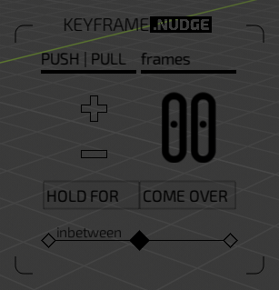
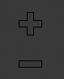
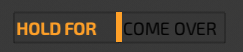
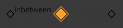

# keyframe.NUDGE
Blender scripts for quick keyframe maniplation.  
With dedicated OpenGL UI in 3d Viewport.
## Installing
nothing yet

## UI

* __Tool State Button__ - Changes the types of scripts related to the main buttons.  
__Keyframe__ - scripts that work with regular keyframes  
__Grease__ - scripts that work with Grease Pencil keyframes  

* __Panel position control__ - Changes position of panel in 3d Viewport

* __Push\Pull - Nudge Button__ - Changes the mode of the '+,-' buttons

* __Frames-Seconds Button__ - Changes number field's input mode from frames to seconds

* __'+' Button__ - executes 'Push\Pull' or 'Nudge' scripts with 'Number Field' value, resulting in change + _time_
* __'-' Button__ - executes 'Push\Pull' or 'Nudge' scripts with 'Number Field' value, resulting in change - _time_

* __Number Field__ - select value for Push\Pull,Nudge,Hold For scripts.  
    * __'<>' Buttons__ increase or decrease value on click.  

    * When clicked on the number, user enters edit mode where he can change value via keyboard input:
        * __Backspace__ - remove number from value.
        * __Keyboard 0-9 and Numpad 0-9__ - adds numbers to value.
        * __Keyboard '.'__ - when mode is seconds, user can give float(decimal) values to final value(precision- one decimal value, example - 22.5).
        * __Enter(Return,Numpad Enter)__ - exits edit mode.  

* __Hold For Button__ - Executes 'Hold For' script with the value from 'Number Field'.  

* __Come Over Button__ - Executed 'Come Over' Script  

* __Inbetween Slider__ - When click or click and drag executes 'Inbetween' Script

## Scripts
### Keyframe
Scripts work with regular keyframes for objects in object mode and bones in pose mode.
* **Push/Pull** - Pushes or pulls all keyframes based on:
    * Marker Position - when no keyframes are selected
    * Selected Keyframe - from selected keyframe
* **Nudge** - Moves keyframe/s in +,- _time_ based on user value.

* **Hold For** - arranges selected keyframes so they have equal distance:  
    _- if one keyframe is selected_ - move all keyframes after the selected keyframe, so that the distance in frames between the selected keyframe and the non selected keyframes equals to the value given by the user.  
    _- if multimple keyframes are selected_ - arranges selected keyframes so they are equal distance from each other(in frames equals the user input value), also makes sure the distance between the last selected keyframe and the first non selected keyframe(after the last selected) is also the user imput value.
* **Come Over** - Executes a Push\Pull type of movement on keyframes - all keyframes from selected keyframe in +_time_, are moved as a block at timeline marker's position. Thus the selected keyframe acts as an origin point of movement of the whole block of keyframes(selected or non selected) to timeline marker's position.

* **Inbetween** - Creates a keyframe or edits one, based on these cases:
    * **No Selected keyframes** - Creates a keyframe based on timeline marker's position. X-position or frame number, is the halfway point between the keyframes to the left and right of timline marker. Y-position or Value of the keyframe, is the halfway value between the values of the keyframes that are to the left or right of the timeline marker. If timeline marker is over a keyframe, it will go in to Edit Mode explained in '1 Selected Keyframe case' 
    * **1 Selected Keyframe** -  Modifies the selected keyframe's value based on the values of kefyrames to the left or right of the selected keyframe. Slider controls the proportion or how close is the new value of the keyframe to the value of the left or right keyframes respectively.
    * **2 Selected Keyframes** - Creates a keyframe based on timeline marker's position. X-position or frame number, is the timeline marker's position. Y-position or Value of the keyframe, is the Slider controled proportion between the left selected keyframe and the right selected keyframe.
    * **3 Selected Keyframes** - Script enters Edit Mode explained in '1 Selected Keyframe' case. Except this time value is a Slider controled proportion of the values of the left selected and right selected keyframes.

### Grease
Scripts work with grease pencil keyframes, found in the grease pencil editor in the Dope Sheet.
>Not yet available    
Push\Pull  
Nudge  
Hold For  
Come Over
